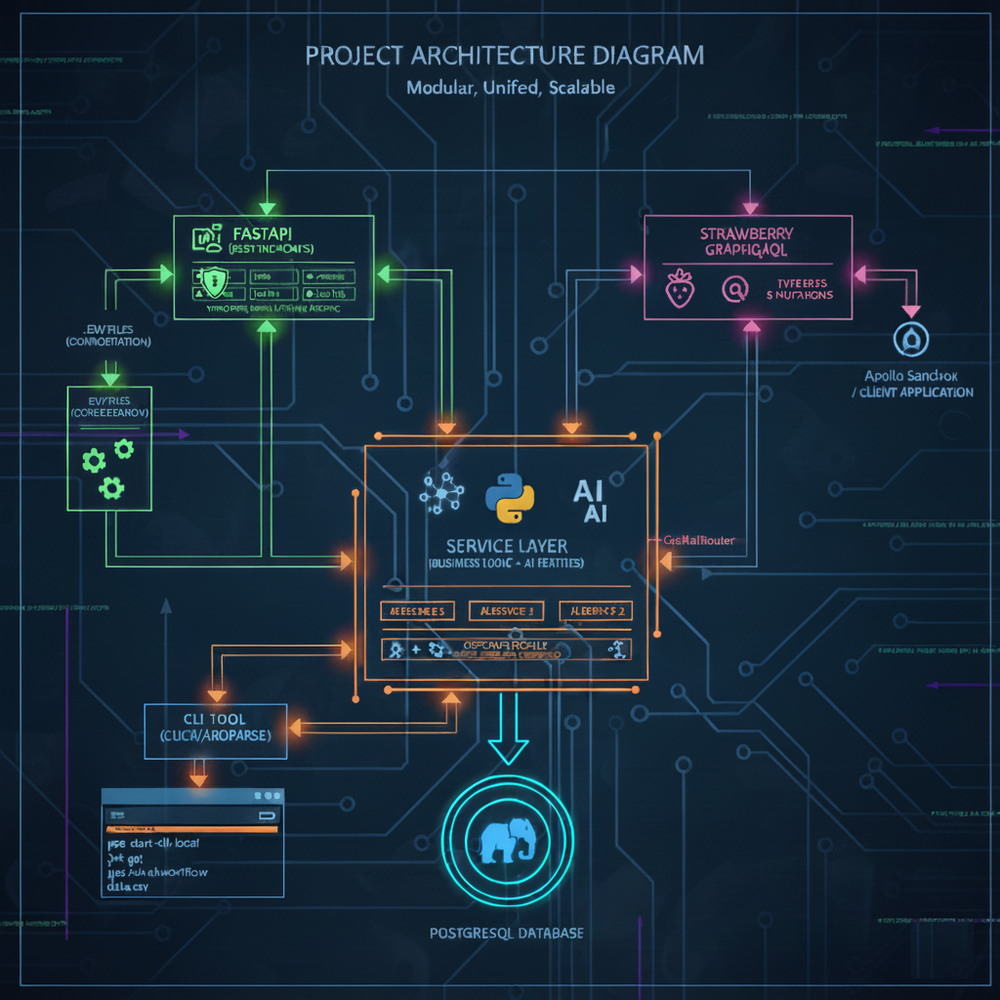
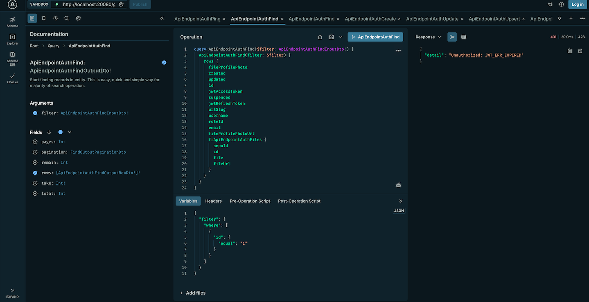
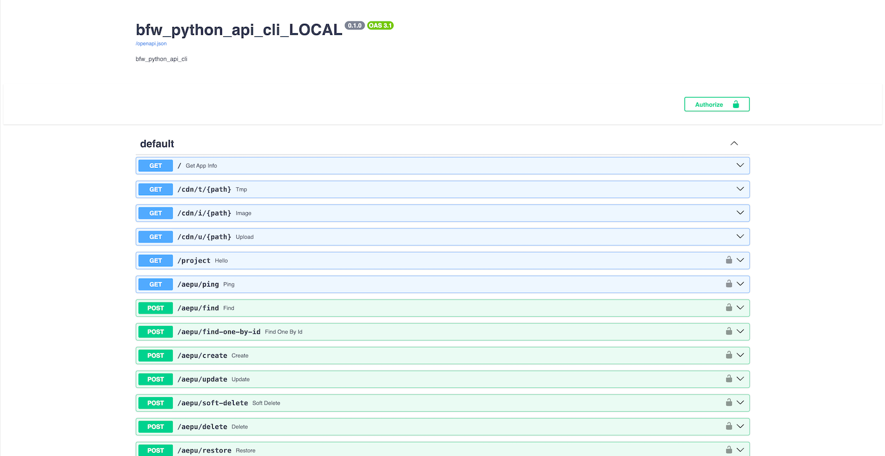
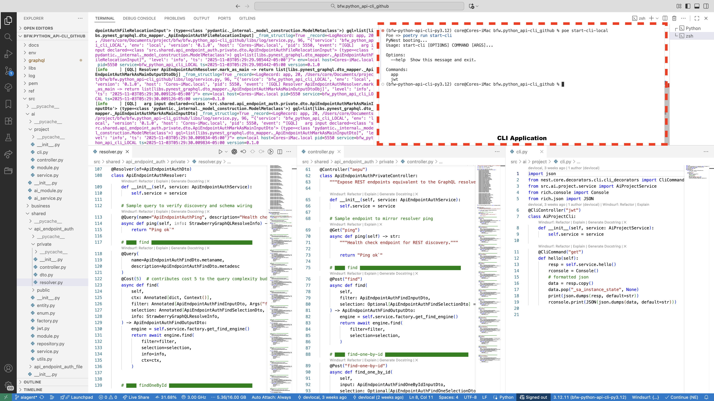
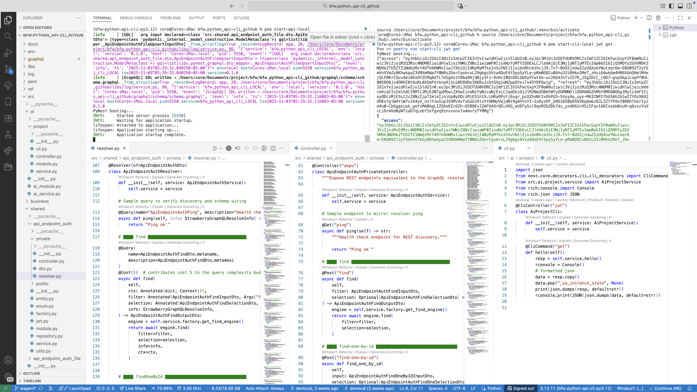

# Project
AI Services Platform - Python FastAPI REST & GraphQL APIs + CLI App

# Description
All-in-one AI-powered services via REST and GraphQL from a single codebase also support CLI (command-line) interface for operations

Workflow of the whole project

GraphQL API Interface

REST API Interface

CLI APP Interface

Get JWT using CLI APP

# Challenge
The client needed a flexible backend platform that could:

Expose AI-powered services via REST and GraphQL from a single codebase.

Support not only API usage but also a CLI (command-line) interface for operations, admin tasks, and batch/interactive workflows.

Make it easy to build and deploy new AI-features (model calls, data-processing, pipelines) without requiring separate stacks for API vs CLI.

# Solution
Built the platform in Python, combining frameworks and libraries: FastAPI (for REST), Strawberry GraphQL (for GraphQL) — Strawberry integrates cleanly with FastAPI.

Defined a unified service layer (business logic + AI features) such that both REST endpoints and GraphQL resolvers invoke the same internal functions—avoiding duplication of logic.

Enabled CLI tool functionality: The same service layer was exposed via a CLI application (using Click/Argparse libraries) so administrators/devs could run commands like "poe start-cli-local jwt get", or trigger AI workflows directly from the terminal.

Built GraphQL schema using Strawberry: type definitions, queries & mutations, integrated into FastAPI via GraphQLRouter. Used Apollo Sandbox for playgound.

Set up a relational database backend (PostgreSQL) for persistent storage of service data (user records, AI-job metadata, results).

Ensured the architecture was modular: new AI-services could be added easily by creating a new module (service function + API endpoint + CLI command) and wiring it into the platform.

Provided logging, error-handling, versioning for API endpoints and CLI commands so that the platform could be maintained and scaled.

Programming code is highely configurable using .env files.

# Tech Stack
- Python (3.x)
- FastAPI (REST endpoints)
- Strawberry GraphQL (GraphQL API)
- PostgreSQL (database)
- CLI tool: Python CLI library (Click/Argparse)
- AI-services integration: custom modules (model calls, data-processing)
- Service layer abstraction so APIs + CLI share logic

# Highlight
This project sharpened my ability to architect a platform that spans multiple interface modalities (REST, GraphQL, CLI) while keeping the underlying service logic DRY and maintainable. It shows how to build for both consumption (API clients) and internal tooling (CLI) in one clean Python stack.

---
*Disclaimer applied