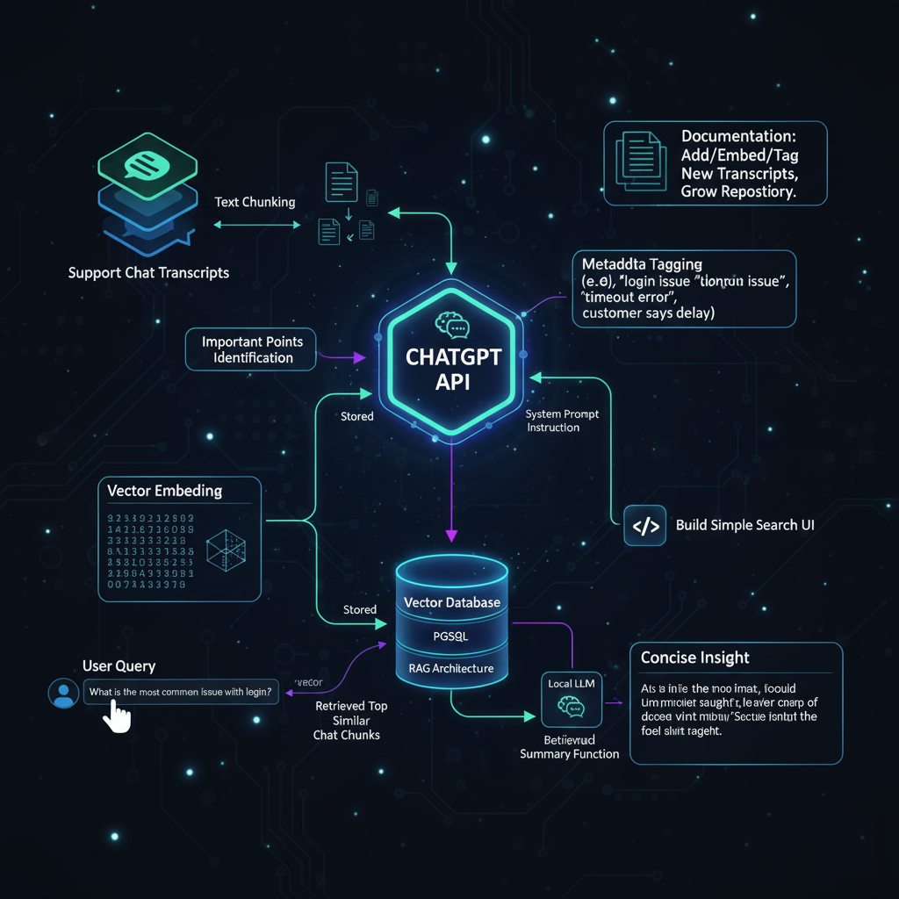
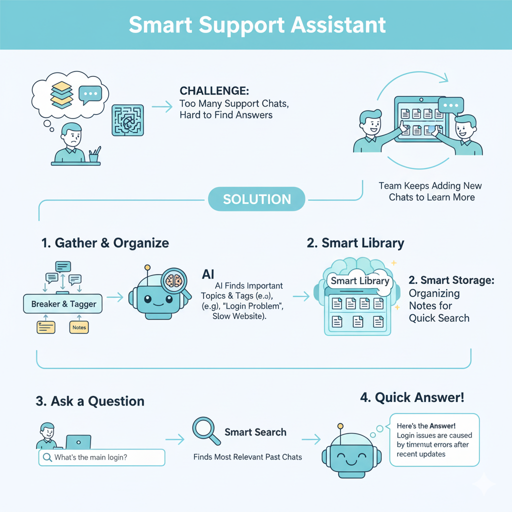

# Project
Chat Transcript Intelligence using OpenAI API & RAG Retrieval System

# Description
Save the “important bits” of chats (like customer complaints, recurring issues) so that future team members could quickly search them and reuse insights

Tech Workflow

App Workflow

# Challenge
The client had many support chat transcripts. They wanted to save the “important bits” of these chats (like customer complaints, recurring issues) so that future team members could quickly search them and reuse insights rather than starting fresh each time.

# Solution
Collected chat transcripts from the support system and converted them into text chunks. Send those to ChatGPT using API to identify important points. Use system prompt to instruct AI model to filter content.

Embedded each chunk into a vector representation and stored them in a vector database for semantic search. (PGSQL with Vector DB + RAG architecture)

Build API which can be used to build a simple search UI. User inputs a query like “what is the most common issue with login” → system transforms query to vector → retrieves top similar chat chunks → feeds those chunks to local LLM (summary function) which returns a concise insight.

Added metadata tagging: for each chunk, stored tags like “login issue”, “timeout error”, “customer says delay” so search could also filter by tag. This is as per returned data from ChatGPT API.

Documented the process so the client’s team can add new transcripts, embed them, tag them and keep the repository growing.

# Tech Stack
- Transcript ingestion: Python
- Embeddings & vector DB: PostgreSQL with pgvector extension
- Search API: Simple Python FastAPI
- Summary/insight generation: Small local LLM invoked on retrieved chunks
- Metadata tagging: ChatGPT API response based + rules-based

# Highlight

This project sharpened how to turn unstructured conversation data into searchable, actionable intelligence using RAG vector-storage + retrieval + summarisation.

---
*Disclaimer applied