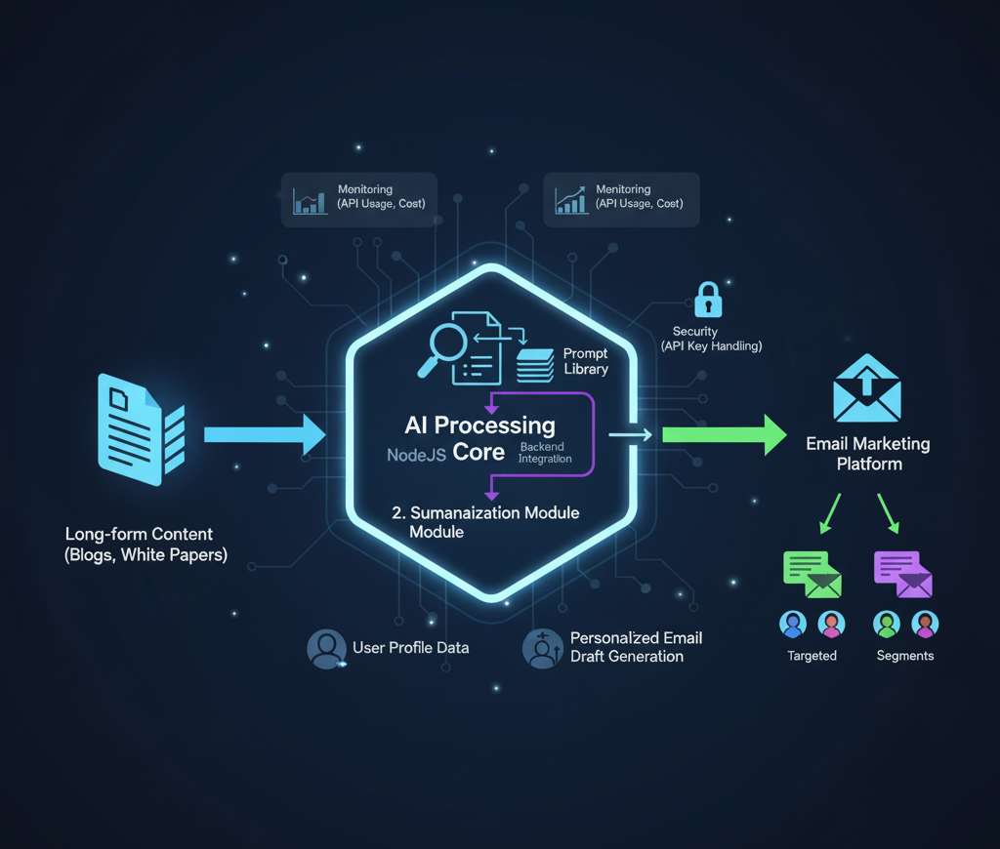
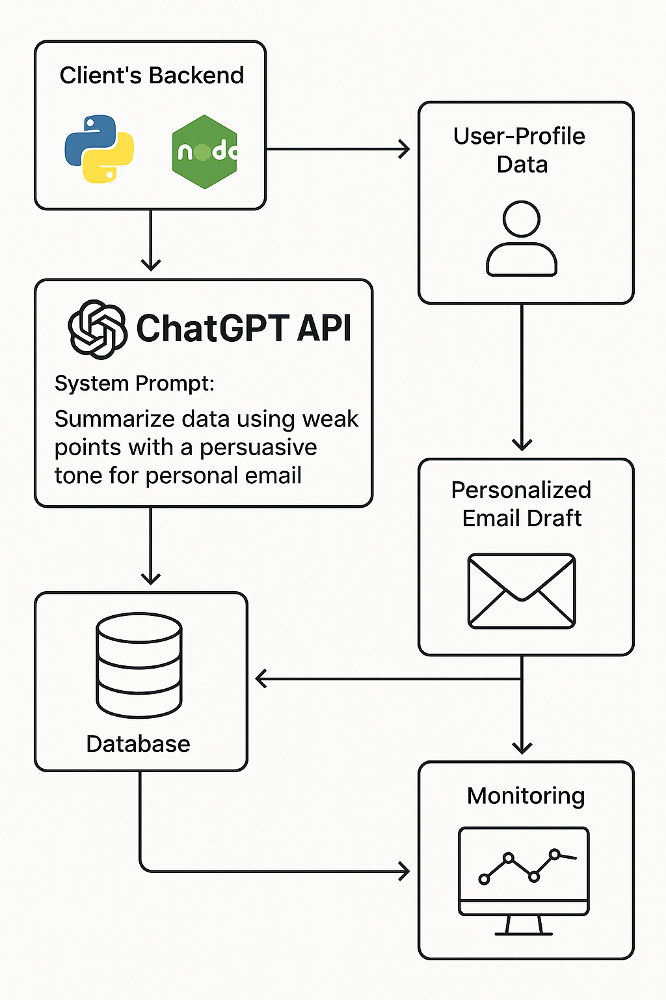

# Project
Data Summarisation & Personalised Email Generation via ChatGPT API

# Description
Automatically summarise long-form data and use those summaries to generate personalised email.

Tech Workflow

Diagram

# Challenge
The client needed a scalable way to automatically summarise long-form data collected from internet and saved in database into concise key-points.

Use those summaries to generate personalised email marketing messages tailored to individual user profiles. The manual process was slow, inconsistent and costly.

# Solution
Integrated the OpenAI ChatGPT API into the client’s backend (Python/NodeJS) so the system could accept content, summarise it intelligently, and output desire result.

Based on standard methods for summarisation of large text via LLMs.
Used a system prompt: e.g., “Summarise data using weak points with a persuasive tone for personal email”

Created a second module that accepted user-profile data (preferences, past activity) and used that along with the content summary to generate a personalised email draft via the ChatGPT API.

Save the response in database for further process. Set up monitoring around API usage, latency and cost (token usage) to ensure the process was efficient.

# Tech Stack
- Backend: Python/NodeJS
- API: OpenAI ChatGPT API
- Monitoring: Basic logging of usage/costs

# Highlight
This project sharpened my skills in prompt engineering, API integration for marketing automation, and bridging content systems with email workflows. It demonstrates how AI can move beyond “nice to have” into practical marketing operations.

---
*Disclaimer applied