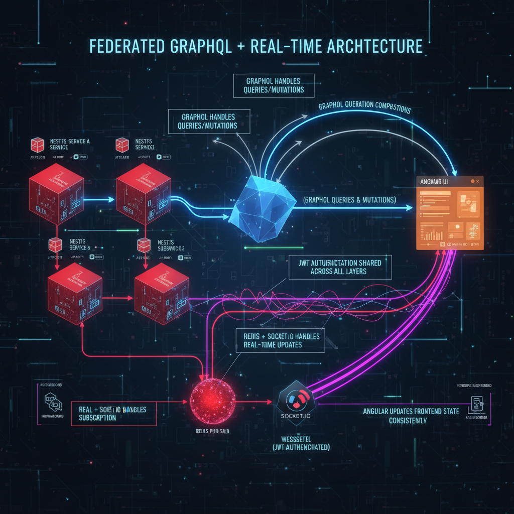
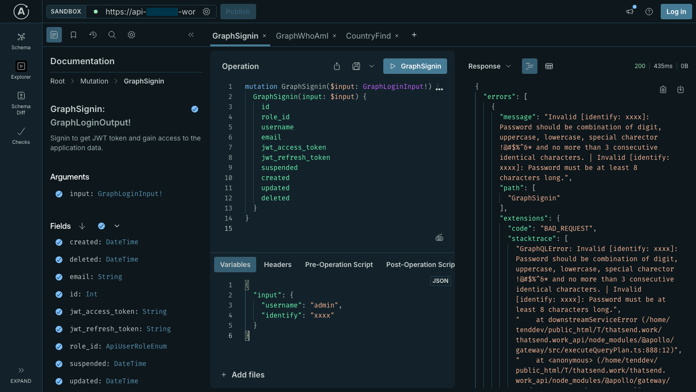

# Project
Microservices API - NodeJS, NestJS, GraphQL, REST + WebSocket

# Description
API backend built in microservice architecture, connecting multiple services in super graph + WebSocket for real time update

Tech Workflow

API Playground

# Challenge
The client needed a robust enterprise-grade platform:

API backend built in microservice architecture, connecting multiple services, all exposed via GraphQL in a federated schema.

Front-end UI built in Angular interacting with the GraphQL API for data heavy workflows.

Real-time updates required (via WebSocket) for live features (notifications, live dashboards) but the chosen stack (Apollo Federation) did not natively support WebSocket subscriptions in the way the client needed.

# Solution
Implemented backend services using NestJS (Node.js) each exposing GraphQL subgraphs which can be accessed using valid JWT authentication.

Set up an Apollo Federation gateway that composed the sub-graphs into a unified super-graph. This allowed queries/mutations across the federated microservices. For the UI, developed Angular components that consumed the GraphQL API.

Identified that WebSocket subscription support in a federated GraphQL scenario is limited / complex (subscriptions in federated graphs have architectural challenges).

Designed a workaround: instead of relying on GraphQL subscriptions via WebSocket through the federation stack, used a Redis Pub/Sub + Socket.IO layer to support real-time updates.

Backend services would publish events (via Redis) when important state-changes occurred (e.g., new data available, user requires notification).

A separate WebSocket server (Socket.IO) subscribed to Redis channels and forwarded real-time events to connected Angular clients.

The GraphQL API still served queries/mutations; the real-time channel was handled outside of the federated graph.

Ensured that the WebSocket/Socket.IO layer integrated smoothly with authentication (shared JWTs), correlated with GraphQL operations so that front-end state remained consistent.

Documented the architecture, created monitoring/logging for the Redis channel and WebSocket connections, and provided training for DevOps on scaling the event layer.

# Tech Stack
- Backend: Node.js, NestJS framework
- GraphQL: Apollo Federation (sub-graphs + gateway)
- Microservices: Several domain-services using different port number (user, order, notifications, etc.)
- Real-Time: Redis Pub/Sub + Socket.IO WebSocket server
- Front-end: Angular (not a part of this project)
- Database(s): MySQL (enterprise relational data)
- Deployment / DevOps: GitLab CI/CD
- Monitoring & Logging: Pino logger

# Highlight
This project sharpened my ability to architect enterprise-scale API platforms: combining microservices, GraphQL federation, real-time WebSocket work-around, and enterprise relational databases. It shows how to pragmatically handle limitations in standard stacks (e.g., federation + WebSocket) and deliver functional real-time capabilities.

---
*Disclaimer applied