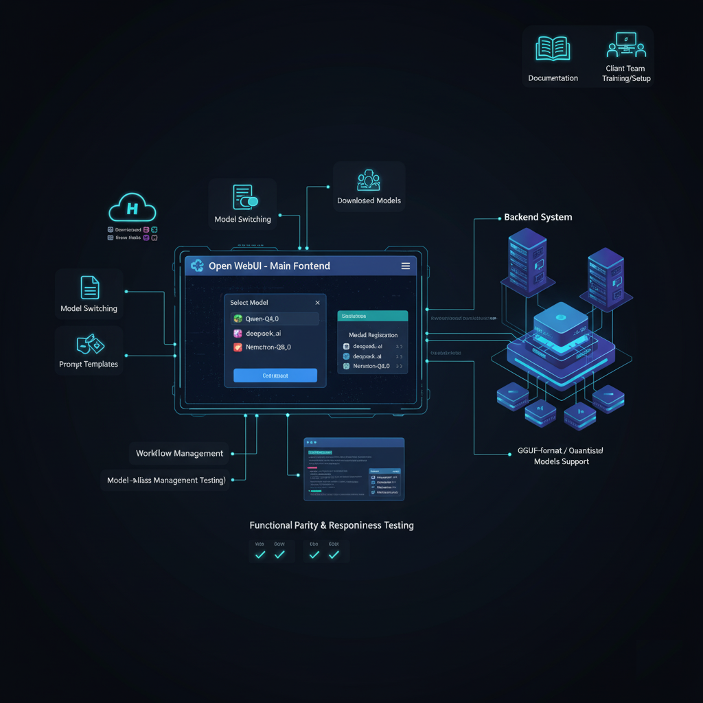
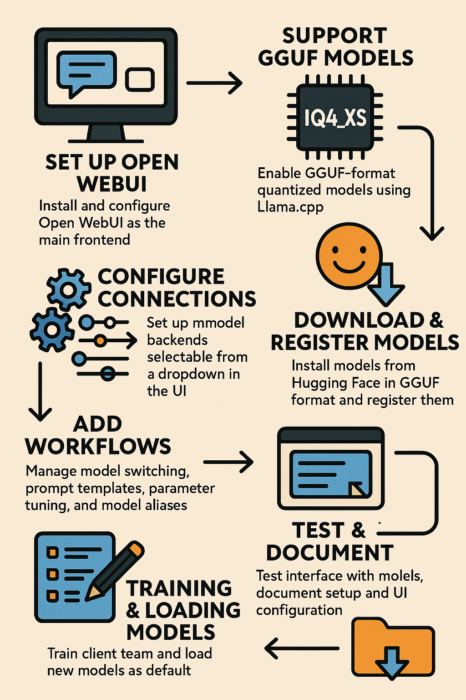

# Project
Multi-Model LLM Setup via Open WebUI with GGUF Quantised Models

# Description
Internal / SaaS Platform / AI-Tool Concept. Flexible UI to run multiple large language models (LLMs) locally or semi-locally

Tech Workflow

App Workflow

# Challenge
The client wanted a flexible UI to run multiple large language models (LLMs) locally or semi-locally, support quantised formats (GGUF), use multiple model variants (Qwen, deepseek-ai, openai/gpt-oss, nvidia/Nemotron) and present them via a clean ChatUI. They needed a system where models could be swapped, configured, tested quickly, and used via a unified UI rather than each model having its own adhoc interface.

# Solution
Installed and configured Open WebUI (which provides a web-based interface to chat/playground with LLMs) as the main frontend.
docs.openwebui.com

Set up support for GGUF-format quantised models. IQ4_XS (which allow smaller memory footprint and faster load/inference) using the Llama.cpp/compatible backend.

Downloaded/installed models from the Hugging Face hub in GGUF format (for example quantised versions of Qwen, deepseek-ai) and registered them in the Open WebUI “Models” module.
documentation.suse.com

Configured the “Connections” or “Settings” within Open WebUI to connect to the model backends (local model servers, Llama.cpp) so that the UI could select among different models in a dropdown.
docs.openwebui.com

Added workflows to manage: model switching, prompt templates, parameter tuning (context size, temperature, quantisation selection), and model-alias management (so the user could pick “Qwen3-Coder-4B-A3B-Instruct-IQ4_XS.gguf” or “Nemotron-IQ4_XS”).

Tested the interface with each of the listed models: Qwen, deepseek-ai, openai/gpt-oss, nvidia/Nemotron (or whichever exact names you used) for functional parity, prompt responsiveness, load times.

Documented the setup: how to add a new GGUF model, how to swap quantisation levels (IQ4_XS, Q4_K_S, Q8_0 etc as available), how to configure the UI.

Provided training/setup for the client’s team: how to load new models from Hugging Face, how to register them in Open WebUI, how to set them as default.

# Tech Stack
- Frontend: Open WebUI (web interface)
- Backend: Llama.cpp
- Models / Formats: GGUF quantised models from Hugging Face (Qwen, deepseek-ai, openai/gpt-oss, nvidia/Nemotron)
- Infrastructure: Local server / GPU/CPU environment, Docker or native, model management via Open WebUI.
- Configuration & Workflow: Model aliasing, prompt templates, UI model dropdown, model parameter tuning.

# Highlight
This project sharpened my ability to integrate open-source LLM ecosystems (quantised model formats, local inference), bring them under a unified UI, and make model experimentation accessible for non-AI-specialist users. The work sits at the intersection of system-architecture + AI-model integration + UX.

---
*Disclaimer applied