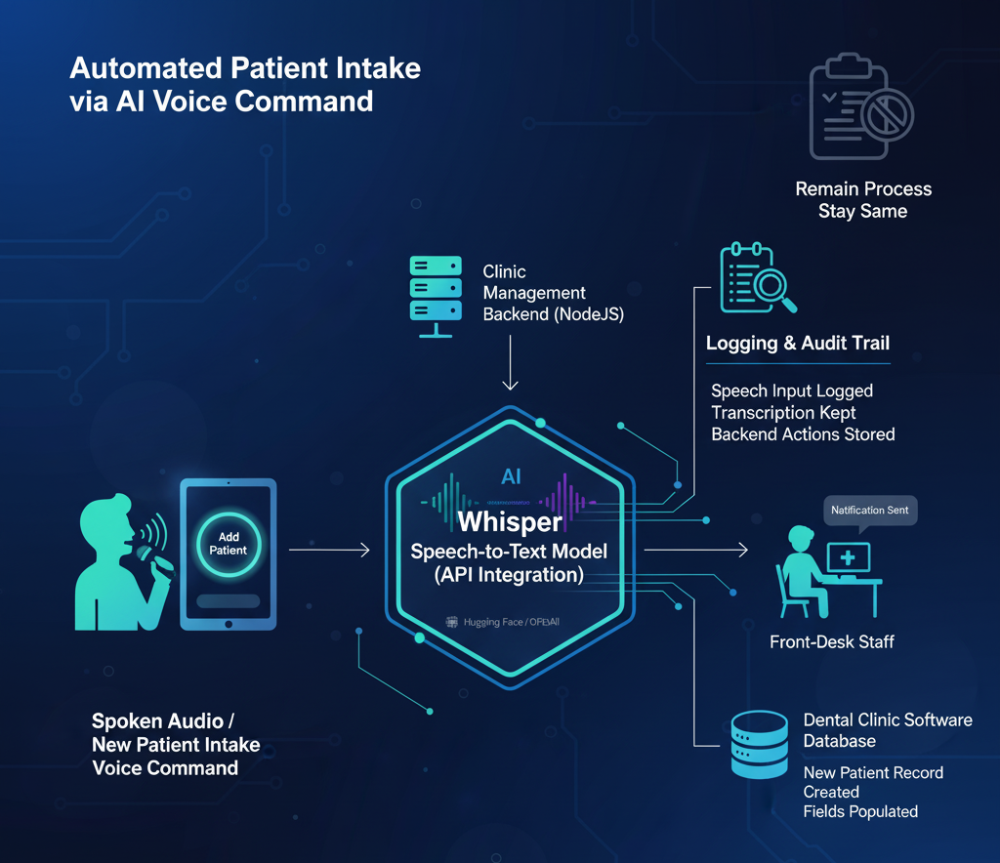
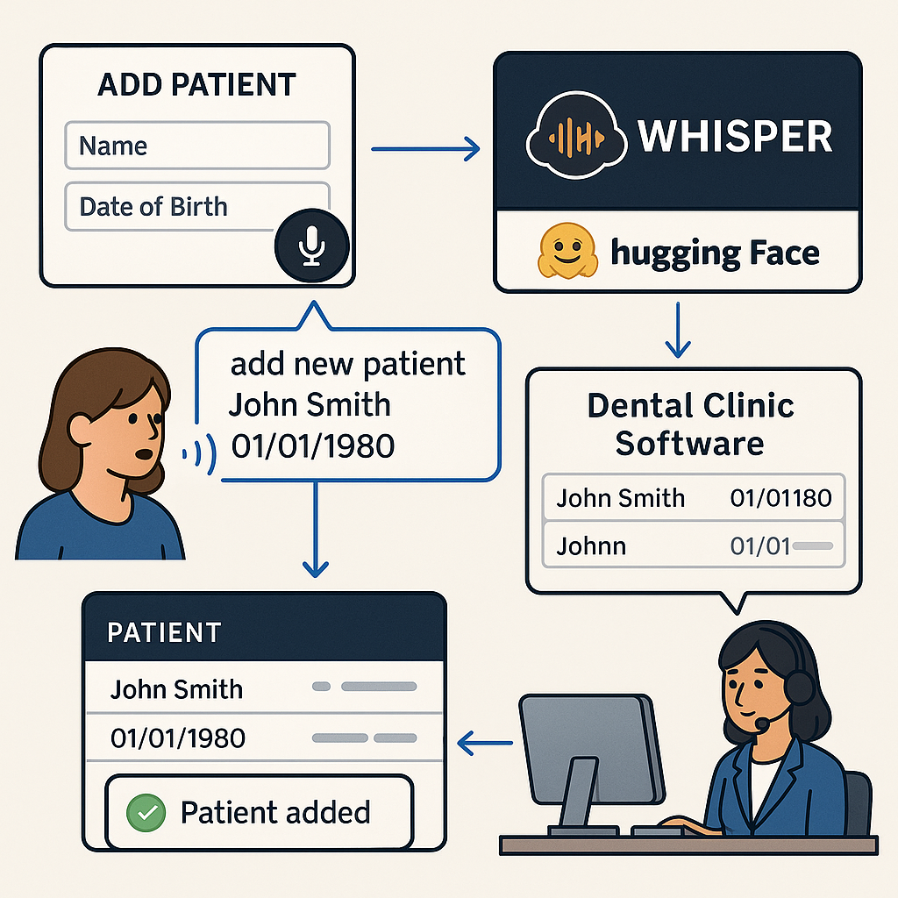

# Project
Speech-to-Text automation using open source offline Whisper AI model

# Description
Desktop based offline software require new patient add feature AI driven so no need to fill up the form

Tech Workflow

App Workflow

# Challenge
The dental clinic had manual patient intake and data-entry workflows: when a patient arrived or called in, staff had to manually type details. The client wanted a faster, hands-free way: the clinic-software should accept spoken input (from front-desk or dentist) and automatically create or update patient records, schedule appointments, or trigger actions in the system.

# Solution
Integrated the Whisper speech-to-text model (via its API) into the clinic-management backend so spoken audio could be transcribed reliably.

Triggered the appropriate backend API when button clicked beside the add form. So, feature is more specific to add new patient only.

Downloaded and used model:
https://huggingface.co/openai/whisper-medium

Connected the module with the existing dental-clinic software database: when a new patient intake voice command was detected, the system created a patient record, populated fields, and notified the front-desk staff. Used AI tool feature to perform real time insert. Remain process stay same no change.

Logging & audit trail: every speech-input action was logged, transcription kept, and backend action stored so staff could review or revert mistakes.

# Tech Stack
- Speech-to-text: Whisper model (Offline model)
https://huggingface.co/openai/whisper-medium

- Backend: NodeJS + SQLIte + External Python Script (existing platform)
- Intent-parser & action-trigger: custom module in Python/NodeJS
- Front-end: clinic-software UI updated to allow “voice input” mode

# Highlight
This project sharpened my skills in integrating cutting-edge speech-to-text (Whisper) into a real-world operational system (a dental-clinic management platform) and bridging the gap between voice input and structured system actions.

---
*Disclaimer applied