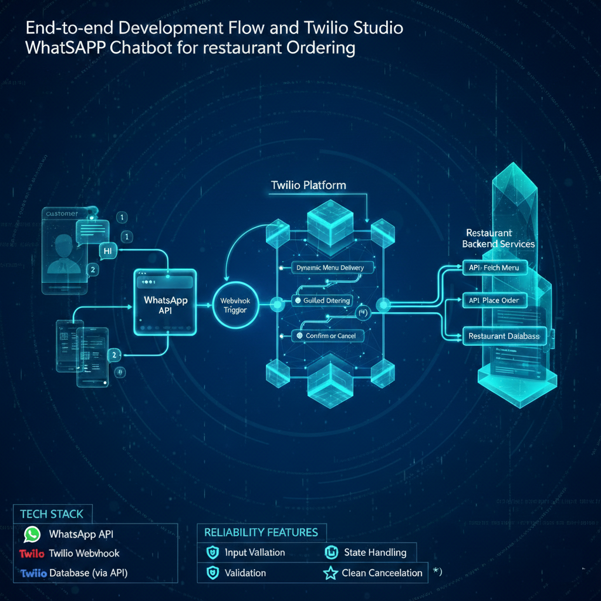
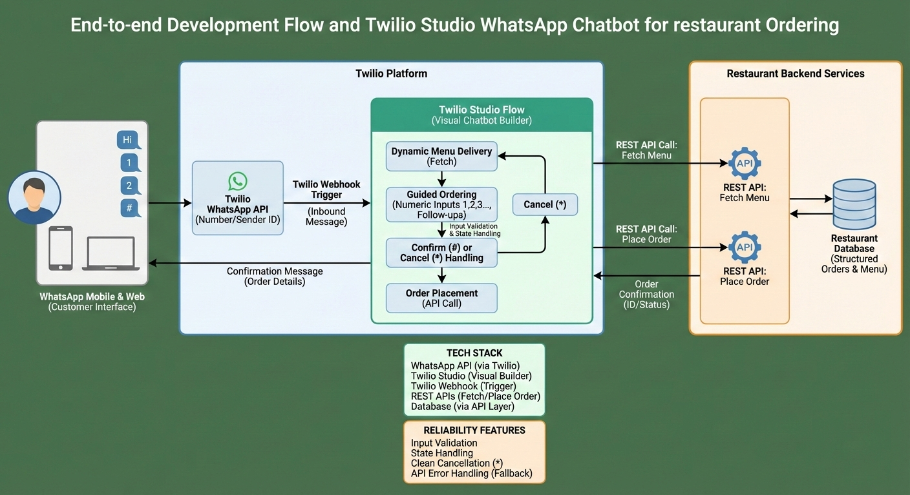

# Project
Twilio Studio WhatsApp Chatbot for Restaurant Ordering

# Description
Built a WhatsApp-based ordering chatbot using Twilio Studio that lets customers browse a restaurant menu, place an order using simple numeric inputs (1,2,3…), confirm or cancel instantly, and then saves the final order into the restaurant’s database via secure REST APIs. Works on WhatsApp mobile and WhatsApp Web.

Tech Workflow

<video width="320" height="240" controls>
  <source src="https://github.com/open-source-ckw/case-study/blob/main/Twilio%20Studio%20WhatsApp%20Chatbot%20for%20Restaurant%20Ordering/twilio-studio-console-chatboat.mp4" type="video/mp4">
  Your browser does not support the video tag.
</video>

Error with video? Watch the same clip on Google Drive.
https://drive.google.com/file/d/1C7fyyipGBlT0Xcg9Qg7UFa7Kl_PYFMfI/view?usp=sharing

Workflow

# Challenge
Restaurants want WhatsApp ordering because customers already use it, but the operational reality is messy:

Manual chat handling doesn’t scale: Staff waste time answering the same menu questions and taking orders line-by-line.

Menu changes frequently: Static “menu messages” become outdated fast (price/items/availability).

Order flows break easily: Customers change their mind, type unexpected messages, or cancel mid-way.

No structured data: Human chat orders are hard to convert into clean database records.

Need reliable automation without building a full app: Many businesses want ordering without investing in a full mobile app/website rebuild.

# Solution
Implemented an automated WhatsApp ordering experience using Twilio Studio + Twilio Webhooks + Restaurant REST APIs.

End-to-End Flow:

- WhatsApp number setup
- Used a Twilio WhatsApp-enabled number or connected an existing business WhatsApp number (registered sender ID).
- Inbound message trigger
- Every customer message hits Twilio, which triggers the Twilio Studio Flow via webhook.
- Dynamic menu delivery
- Bot fetches the latest menu from the database using a REST API (so menu is always current).
- Guided ordering
- Customers select items using 1, 2, 3 style inputs (simple, fast, low error rate).
- Bot asks follow-up questions like quantity, add-ons, delivery/pickup details (as per business rules).
- Confirm or cancel
- Customer confirms by pressing #
- Customer cancels with * and instantly returns to the menu (no awkward “start over” chaos).
- Order placement
- On confirmation, bot calls the Place Order API, stores the order in DB, and receives an order ID/status.
- Customer confirmation message
- Bot replies with order confirmation details (order ID, summary, next steps).
- Reliability & Control (important in real life)
- Input validation (wrong number, out-of-range choice, unexpected text)
- State handling (menu → item selection → confirmation → back to menu)
- Clean cancellation handling (* always works)
- API error handling (fallback message + return to menu instead of dead ends)

# Tech Stack
- WhatsApp API (via Twilio WhatsApp channel)
- Twilio Studio (visual chatbot flow builder)
- Twilio Webhook (incoming message trigger + API integration)
- REST APIs (menu fetch, order creation, order confirmation)
- Database (via API layer) (orders stored in structured format)

# Highlight
- No app needed: Customers order directly from WhatsApp (mobile + web).
- Always-updated menu: Menu is fetched live from database through API.
- Frictionless UX: Numeric selection (1/2/3) + quick confirm (#) / cancel (*) is fast and familiar.
- Operational efficiency: Reduces staff workload and order-taking time dramatically.
- Clean structured data: Every order is stored properly in DB, ready for kitchen/POS/invoicing workflows.
- Scalable flow design: Easy to extend with offers, delivery tracking, feedback, coupons, and re-order.
- Fail-safe handling: Prevents broken conversations with validation + graceful recovery paths.

---
*Disclaimer applied